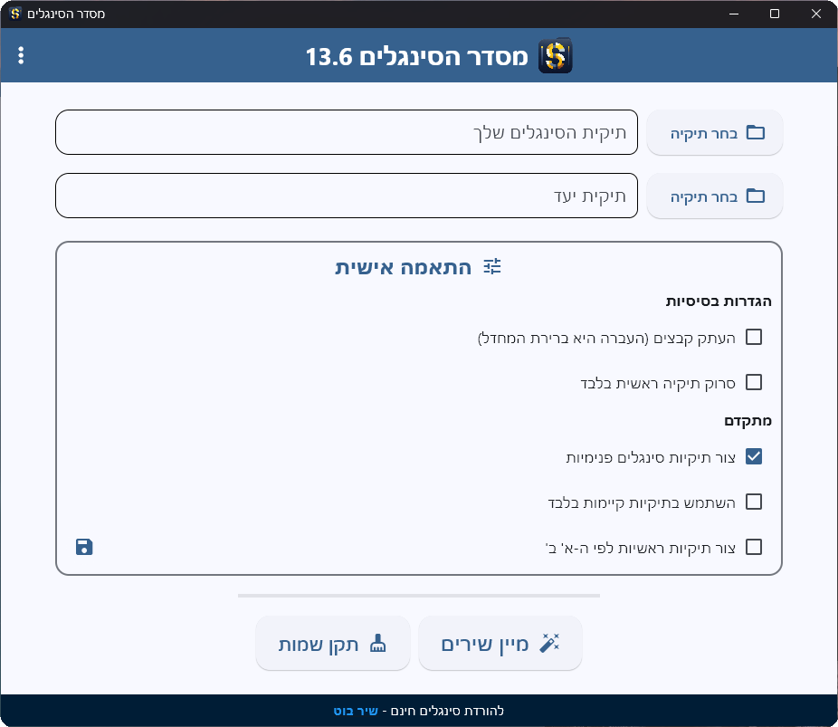
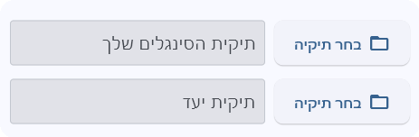
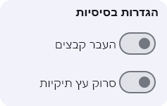
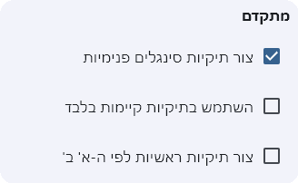
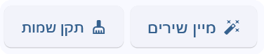
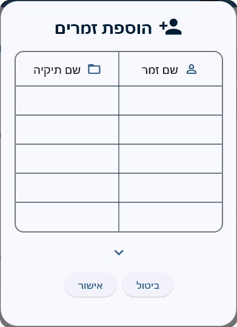

# מסדר הסינגלים - מדריך למשתמש

מסדר הסינגלים הוא כלי מתקדם ופשוט לשימוש שמסייע בארגון אוסף המוזיקה שלכם. התוכנה סורקת את התיקיות שבחרתם, מזהה את האמנים וממיינת את קבצי המוזיקה לתיקיות לפי שם האמן, כך שתוכלו למצוא את השירים האהובים עליכם בקלות ובמהירות.

---

## התקנה והפעלה

1. **הורדת התוכנה**: הורידו את גרסת התוכנה המתאימה למערכת ההפעלה שלכם מאתר ההורדות הרשמי.
2. **התקנה**:
   - **Windows**: פתחו את קובץ ההתקנה ופעלו לפי ההוראות המופיעות על המסך.
   - **אנדרואיד**: התקינו את קובץ ה-APK על ידי פתיחתו מהמכשיר שלכם.
3. **הפעלה**: לאחר ההתקנה, הפעילו את התוכנה משולחן העבודה, מתפריט ההתחלה או ממגירת האפליקציות במכשיר האנדרואיד שלכם.

---

## ממשק המשתמש

### תצוגה כללית

התוכנה מציגה ממשק ידידותי ונוח לשימוש, המורכב ממספר חלקים מרכזיים:

- **סרגל עליון**: מציג את שם התוכנה והגרסה, עם כפתור אפשרויות נוספות.
- **בחירת תיקיות**: מאפשרת בחירת תיקיית המקור ותיקיית היעד.
- **הגדרות בסיסיות**: הגדרות מרכזיות להפעלת התוכנה.
- **הגדרות מתקדמות**: מאפשרת גישה לאפשרויות נוספות להתאמה אישית.
- **כפתורי פעולה**: כפתורים לביצוע מיון הקבצים ותיקון השמות.

### בחירת תיקיות

1. **תיקיית הסינגלים שלך**: בחרו את התיקייה המכילה את קבצי המוזיקה שברצונכם למיין. זוהי תיקיית המקור.
2. **תיקיית יעד**: בחרו את התיקייה אליה יועברו או יועתקו קבצי המוזיקה הממויינים.

כדי לבחור תיקייה:

- לחצו על כפתור **"בחר תיקיה"** לצד שדה הטקסט המתאים.
- בחרו את התיקייה הרצויה בחלון שנפתח.
- הנתיב הנבחר יוצג בשדה הטקסט.

### הגדרות בסיסיות

- **העתק קבצים / העבר קבצים**:
  - **העתק קבצים**: הקבצים יועתקו לתיקיית היעד, והמקור יישאר ללא שינוי.
  - **העבר קבצים**: הקבצים יועברו לתיקיית היעד, ויימחקו מתיקיית המקור.
- **סרוק תיקיה ראשית בלבד / סרוק עץ תיקיות**:
  - **סרוק תיקיה ראשית בלבד**: התוכנה תסרוק רק את התיקייה הראשית שבחרתם.
  - **סרוק עץ תיקיות**: התוכנה תסרוק גם את כל תיקיות המשנה שבתוך תיקיית המקור.

### הגדרות מתקדמות

- **צור תיקיות סינגלים פנימיות**: אם מסומן, התוכנה תיצור תיקיית "סינגלים" בתוך כל תיקיית אמן, אליה יועברו הסינגלים.
- **השתמש בתיקיות קיימות בלבד**: אם מסומן, התוכנה תעביר קבצים רק לתיקיות אמנים שכבר קיימות בתיקיית היעד, ולא תיצור תיקיות חדשות.
- **צור תיקיות ראשיות לפי ה-א' ב'**: אם מסומן, התוכנה תיצור תיקיות ראשיות לפי אותיות האלפבית, ובתוכן תיקיות האמנים.

ניתן לשמור את ההגדרות המותאמות אישית על ידי לחיצה על כפתור השמירה (אייקון של דיסקט).

### כפתורי פעולה

- **מיין שירים**: כפתור זה מתחיל את תהליך **מיון הקבצים** בהתאם להגדרות שבחרתם.
- **תקן שמות**: כפתור זה מתחיל את תהליך **תיקון השמות** של הקבצים.

---

## שימוש בתוכנה

### מיון קבצים

תהליך **מיון הקבצים** מאפשר לכם לארגן את קבצי המוזיקה שלכם באופן אוטומטי לתיקיות לפי שם האמן.

#### כיצד זה עובד?

1. **זיהוי אמנים**: התוכנה מנתחת את שמות הקבצים ואת המטה-נתונים (Metadata) שלהם כדי לזהות את האמן.
2. **יצירת מבנה תיקיות**: התוכנה יוצרת תיקיות עבור כל אמן שזוהה, בהתאם להגדרות שבחרתם.
3. **העברת או העתקת קבצים**: הקבצים מועברים או מועתקים לתיקיות המתאימות.

#### שלבי התהליך

1. **בחירת תיקיות**: ודאו שבחרתם את **תיקיית המקור** ואת **תיקיית היעד**.
2. **בחירת הגדרות**: התאימו את ההגדרות הבסיסיות והמתקדמות לפי הצורך.
3. **הפעלת המיון**:
   - לחצו על כפתור **"מיין שירים"**.
   - תופיע הודעת אזהרה המאשרת את הפעולה. קראו את ההודעה ולחצו על **"אישור"** כדי להמשיך.
4. **תהליך המיון**:
   - התוכנה תתחיל בסריקת הקבצים.
   - תוכלו לראות את התקדמות התהליך באמצעות סרגל ההתקדמות.
5. **סיום התהליך**:
   - בסיום, תוצג הודעה עם **סיכום המיון**, כולל:
     - מספר השירים שמויינו.
     - מספר תיקיות האמנים שנוצרו.
     - האמנים המובילים במספר השירים.

### תיקון שמות

תהליך **תיקון השמות** נועד לשפר את שמות הקבצים ואת המטה-נתונים שלהם.

#### מה התהליך כולל?

1. **הסרת תוכן מיותר**: הסרת מילים או ביטויים מיותרים משמות הקבצים, כגון "חדשות המוזיקה", "מייל מיוזיק" וכדומה.
2. **תיקון ג'יבריש**: תיקון תווים שאינם מוצגים כראוי (ג'יבריש) במטא-נתונים של הקבצים, בכותרת, האמן, האלבום ועוד.
3. **עיצוב שם הקובץ**: הסרת קווים תחתונים משם הקובץ.

#### שלבי התהליך

1. **בחירת תיקיית המקור**: בחרו את התיקייה המכילה את הקבצים שברצונכם לתקן.
2. **הפעלת התיקון**:
   - לחצו על כפתור **"תקן שמות"**.
   - תופיע הודעת אזהרה המאשרת את הפעולה. קראו את ההודעה ולחצו על **"אישור"** כדי להמשיך.
3. **תהליך התיקון**:
   - התוכנה תתחיל בסריקת הקבצים ותבצע את התיקונים הנדרשים בשמות הקבצים ובמטא-נתונים.
4. **סיום התהליך**:
   - תוצג הודעה המאשרת את השלמת התיקון.

---

## הגדרות מתקדמות

### הוספת זמרים אישית

אם ברצונכם להוסיף זמרים שאינם קיימים במאגר התוכנה, תוכלו לעשות זאת באמצעות **דיאלוג הוספת זמרים**.

#### כיצד להוסיף זמרים?

1. **גישה להגדרות מתקדמות**:
   - לחצו על כפתור התפריט (שלוש נקודות) בסרגל העליון.
   - בחרו ב**הגדרות מתקדמות**.

2. **פתיחת דיאלוג הוספת זמרים**:
   - תחת הכותרת **"הוספת זמרים"**, לחצו על **"ערוך רשימה"**.

3. **דיאלוג הוספת זמרים**:

   

   - ייפתח דיאלוג המאפשר לכם להוסיף ולערוך את רשימת הזמרים האישית שלכם.
   - הטבלה בדיאלוג כוללת שני עמודות:
     - **שם זמר**: השם כפי שמופיע בקבצים (לדוגמה: "מ.ב.ד").
     - **שם תיקיה**: השם שבו תרצו שהתוכנה תיצור את התיקיה עבור הזמר (לדוגמה: "מרדכי בן דוד").
   - **הוספת שורה**: לחצו על כפתור **"הוסף שורה"** כדי להוסיף זמר חדש.
   - **שמירת השינויים**: לאחר שסיימתם לערוך, לחצו על **"אישור"** כדי לשמור את השינויים.

#### יבוא ויצוא של רשימות זמרים

- **יבא קובץ CSV**: מאפשר לייבא רשימת זמרים מקובץ CSV חיצוני.
- **יצא לקובץ CSV**: מאפשר לייצא את רשימת הזמרים האישית שלכם לקובץ CSV.

### מיון דואטים

התוכנה תומכת במיון דואטים (שירים עם יותר מזמר אחד).

#### אפשרויות מיון דואטים

- **העתק לזמר הראשון בשם השיר**:
  - הקובץ יועבר או יועתק לתיקיית הזמר הראשון שמופיע בשם השיר.
- **העתק לכל הזמרים המופיעים בשם השיר**:
  - הקובץ יועבר או יועתק לתיקיות של כל הזמרים המופיעים בשם השיר.

#### כיצד לבחור את המצב הרצוי?

1. **גישה להגדרות מתקדמות**:
   - לחצו על כפתור התפריט (שלוש נקודות) בסרגל העליון.
   - בחרו ב**הגדרות מתקדמות**.

2. **בחירת מצב מיון דואטים**:
   - תחת הכותרת **"מיון דואטים"**, בחרו את האפשרות הרצויה.

---

## עדכונים ושדרוגים

התוכנה בודקת אוטומטית אם קיימים עדכונים זמינים. אם ישנו עדכון, יופיע חיווי על כפתור התפריט בסרגל העליון.

#### כיצד לעדכן את התוכנה?

1. **בדיקת עדכונים**:
   - לחצו על כפתור התפריט (שלוש נקודות).
   - אם קיים עדכון, תופיע אפשרות **"עדכן כעת"**.

2. **הורדת העדכון**:
   - לחצו על **"עדכן כעת"**.
   - התוכנה תפתח את דף ההורדה בדפדפן.
   - הורידו את הגרסה העדכנית והתקינו אותה בהתאם להוראות.

---

## עזרה ותמיכה

אם אתם זקוקים לעזרה נוספת, תוכלו לגשת לתפריט העזרה.

#### כיצד לגשת לעזרה?

1. **לחצו על כפתור התפריט** (שלוש נקודות) בסרגל העליון.
2. בחרו ב**עזרה**.
3. ייפתח חלון עם מידע נוסף והסברים על התוכנה.

---

## אודות התוכנה

**מסדר הסינגלים גרסה 13.7**

התוכנה פותחה כדי לסייע בחוויית האזנה נוחה ומאורגנת למוזיקה האהובה עליכם.

#### לקבלת מידע נוסף

- לחצו על כפתור התפריט (שלוש נקודות).
- בחרו ב**אודות התוכנה**.

---

## טיפים ושאלות נפוצות

### כיצד לבחור את תיקיית המוזיקה שלי?

לחצו על כפתור **"בחר תיקיה"** לצד שדה **"תיקיית הסינגלים שלך"**, ונווטו לתיקייה שבה שמורים קבצי המוזיקה שלכם. לחילופןין, תוכלו פשוט להעתיק את נתיב התיקיה לשדה הטקטס.

### האם התוכנה תיצור תיקיות חדשות?

כן, התוכנה תיצור תיקיות לפי שמות האמנים, אלא אם בחרתם באפשרות **"השתמש בתיקיות קיימות בלבד"**.

### האם ניתן לבטל את הפעולה לאחר שהחלה?

לא, לאחר שהתהליך החל, לא ניתן לבטלו. לכן, ודאו שאתם בוחרים בתיקיות הנכונות לפני תחילת התהליך.

### מה לעשות אם התוכנה לא מזהה אמן מסוים?

תוכלו להוסיף את האמן ידנית באמצעות **דיאלוג הוספת זמרים** בהגדרות המתקדמות.

### האם התוכנה תומכת בקבצי מוזיקה בפורמטים שונים?

כן, התוכנה תומכת במגוון פורמטים נפוצים של קבצי מוזיקה, כולל mp3, wav, flac ועוד.

---

## צור קשר

אם יש לכם שאלות או הצעות, אתם מוזמנים ליצור קשר:

- **דוא"ל**: nh.local11@gmail.com

שיהיה לכם שימוש מהנה ומועיל!